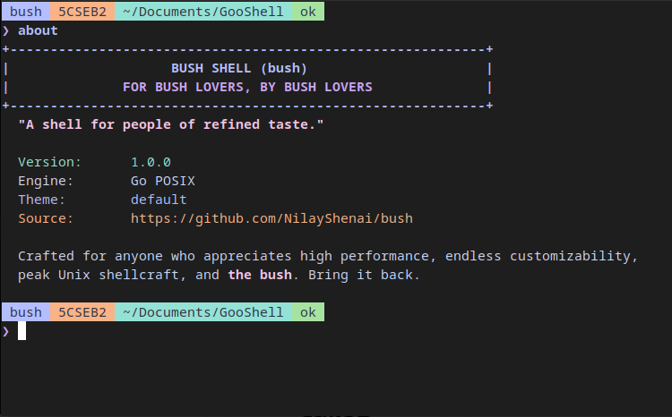

# bush

FOR BUSH LOVERS, BY BUSH LOVERS.  
*"A shell for people of refined taste."*



Bush is a modern, full-featured Unix shell written in Go. Built with zero external dependencies, Bush combines standard POSIX semantics with an integrated developer power pack, sub-millisecond execution latency, native TrueColor styling, and a clean configuration model.

---

## Contents

- [Overview](#overview)
- [Installation](#installation)
- [Login Shell Setup](#login-shell-setup)
- [Developer Suite & Unique Features](#developer-suite--unique-features)
- [Core POSIX Shell Engine](#core-posix-shell-engine)
- [Configuration Reference](#configuration-reference)
- [Keybindings](#keybindings)
- [Architecture & Performance](#architecture--performance)
- [License](#license)

---

## Overview

Traditional Unix shells rely on an ecosystem of external binaries, Python scripts, and third-party plugin managers for features such as frecency jumping, directory bookmarks, port management, syntax highlighting, and safety guards.

Bush implements these capabilities directly inside the shell engine:
- Pure Go implementation using only standard library and direct POSIX syscalls.
- Zero external runtime dependencies.
- Sub-millisecond execution and startup time.
- Integrated safety heuristics to catch catastrophic operations before execution.
- TOML-based declarative configuration (`~/.config/bush/config.toml`).

---

## Installation

### Install Script

```bash
curl -fsSL https://raw.githubusercontent.com/NilayShenai/bush/main/install.sh | bash
```

### Build from Source

Prerequisites: Go 1.19 or higher.

```bash
git clone https://github.com/NilayShenai/bush.git
cd bush
make install
```

Or build manually:

```bash
go build -ldflags="-s -w" -o bush main.go
sudo cp bush /usr/local/bin/bush
sudo chmod 755 /usr/local/bin/bush
```

---

## Login Shell Setup

Bush supports standard POSIX login shell flags (`-l`, `--login`, `-i`, `-s`, `-c`) and can serve as your primary login shell.

### Linux

1. Register Bush in `/etc/shells`:
   ```bash
   echo "/usr/local/bin/bush" | sudo tee -a /etc/shells
   # Or if installed to ~/.local/bin:
   # echo "$HOME/.local/bin/bush" | sudo tee -a /etc/shells
   ```

2. Change your login shell:
   ```bash
   chsh -s /usr/local/bin/bush
   # Or: chsh -s "$HOME/.local/bin/bush"
   ```

3. Launch Bush right now in your active terminal:
   ```bash
   exec bush
   ```
   *Note: Log out of your desktop session and log back in so all new terminal windows open Bush automatically.*

### macOS

1. Register Bush in `/etc/shells` (mandatory on macOS):
   ```bash
   echo "/usr/local/bin/bush" | sudo tee -a /etc/shells
   # Or if installed to ~/.local/bin:
   # echo "$HOME/.local/bin/bush" | sudo tee -a /etc/shells
   ```

2. Change your login shell:
   ```bash
   chsh -s /usr/local/bin/bush
   # Or: chsh -s "$HOME/.local/bin/bush"
   ```

3. Open a new tab (`Cmd + T`) or window (`Cmd + N`) in Terminal.app or iTerm2. Bush starts immediately.

**No-Sudo Alternative on macOS:**
- In **Terminal.app**: Settings (`Cmd + ,`) -> General -> "Shells open with" -> select **Command (complete path)** and enter `/usr/local/bin/bush` (or `~/.local/bin/bush`).
- In **iTerm2**: Preferences -> Profiles -> General -> Command -> enter `bush`.

---

### Reverting Back

To revert back to Bash or Zsh at any time:
```bash
chsh -s /bin/bash
# On macOS: chsh -s /bin/zsh
```

---

## Developer Suite & Unique Features

Bush includes built-in commands designed to eliminate common daily workflow friction:

| Command / Feature | Syntax | Description |
|---|---|---|
| Native Frecency Jump | `z <query>` | Teleport to frequent and recent directories using an internal frequency-recency scoring algorithm. Persists across sessions in `~/.bush_frecency`. Running `z` without arguments displays top-ranked directories. |
| Command Blast Radius Guard | Built-in heuristic | Intercepts high-risk operations (`rm -rf *`, `git reset --hard`, `git push --force`, `dd`, `mkfs`) before execution. Calculates affected file count and prompts for explicit confirmation. |
| Port Doctor | `port [number]` | Lists all active local listening ports (TCP/UDP), protocol, address, and process details. When given a port (e.g. `port 3000`), displays PID, binary path, and listening status. |
| Port Terminator | `killport <number>` | Gracefully terminates (`SIGTERM`), or forcefully kills (`SIGKILL`) if unresponsive, any process bound to a specific port. Resolves `EADDRINUSE` in one command. |
| Differential Live Watcher | `watch [interval] <command>` | Repeatedly runs a command (e.g. `watch 2s "docker ps"`) with real-time diff highlighting on changed output lines. Press `q` or `Ctrl+C` to return to the shell. |
| Environment Loader | `envload [file]` | Safely loads `.env` files into the current session without requiring `direnv`. Automatically masks sensitive tokens (`KEY`, `SECRET`, `PASSWORD`, `TOKEN`) in output. |
| Output Memoizer | `memo <command>` | Caches command standard output in memory. Replay instantly using `memo` or in a pipeline (`memo \| grep ...`) without re-executing slow network queries. |
| Compact Git HUD | `g [args...]` | Running `g` alone displays a 3-line repository card (branch, ahead/behind, staged/modified/untracked counts, and latest commit). Passing arguments delegates transparently to `git`. |
| Pipeline Stream Inspector | `cmd1 \| peek \| cmd2` | Non-intrusively monitors pipeline throughput, byte rates, line counters, and content format on standard error while streaming clean data to standard output. |
| Command Doctor | `why` | Diagnoses the root cause of the previous non-zero exit code. Evaluates Levenshtein distance typo matches and child process lookup failures. |
| Directory Bookmarks | `mark <tag>` / `jump <tag>` / `marks` | Persistent named directory bookmarks stored in `~/.bush_marks`. |
| Math Evaluator | `calc '<expression>'` | Fast recursive-descent math parser (`calc 'sqrt(144) + 2^5'`). |
| Session Telemetry | `dashboard` | Displays shell uptime, memory allocation, execution frequency, and working directory statistics. |
| Auto-Updater | `update [check\|force]` | Checks GitHub for new releases and upgrades Bush directly in-place. Run `update check` to preview without installing. |
| Smart Autosuggestions | `Right Arrow` / `Tab` | Predictive inline ghost text suggestions for executables, subcommands, arguments, and paths, functional even on a fresh install with zero history. |

---

## Core POSIX Shell Engine

- Pipelines: Multi-stage pipes (`cmd1 | cmd2 | cmd3 | ...`).
- Redirections: Input (`<`), truncate output (`>`), append output (`>>`), standard error (`2>`), combined redirection (`2>&1`, `&>`).
- Command Chaining: Sequential (`;`), conditional AND (`&&`), conditional OR (`||`).
- Background Job Control: Background operator (`&`), job listing (`jobs`), foreground (`fg`), background continuation (`bg`).
- Expansions:
  - Variable expansion: `$VAR`, `${VAR}`
  - Exit code: `$?`
  - Shell PID: `$$`
  - Home directory tilde expansion: `~`, `~/path`
  - Wildcard filename globbing: `*`, `?`
  - Subshell command substitution: `$(cmd)`, `` `cmd` ``
- Signal Management: Process-group isolation for foreground and background processes, ensuring smooth `Ctrl+C`, `Ctrl+Z`, and TTY password prompts.
- User Switching Awareness: Automatically adjusts prompt badge to `root` with alert coloring when operating with superuser privileges (`EUID == 0`).

---

## Configuration Reference

Configuration is managed via TOML at `~/.config/bush/config.toml` (with fallback to `~/.bush.toml`).

```toml
[shell]
greeting_banner = true
motto = "A shell for people of refined taste."
history_limit = 5000

[guard]
enabled = true
file_threshold = 10

[prompt]
multiline = true
symbol = "❯ "
badges = ["badge", "user", "dir", "git", "duration", "status"]
max_dir_depth = 4
duration_threshold_ms = 5
show_git = true
show_git_dirty = true

[theme]
name = "lavender" # presets: "lavender", "nord", "tokyo_night", "rose_pine", "custom"

[theme.colors]
accent = "#B4BEFE"
user = "#FAB387"
prompt_symbol = "#CBA6F7"
directory = "#94E2D5"
git_branch = "#F5C2E7"
duration = "#F9E2AF"
success = "#A6E3A1"
error = "#F38BA8"
ghost_text = "#6C7086"
command = "#B4BEFE"
invalid_cmd = "#F38BA8"
flags = "#FAB387"
strings = "#F9E2AF"
border = "#6C7086"

[autosuggest]
enabled = true
suggest_history = true
suggest_subcommands = true
suggest_files = true
suggest_binaries = true

[aliases]
ll = "ls -la --color=auto"
la = "ls -A --color=auto"
gs = "git status"
gp = "git pull"
gpush = "git push"
gd = "git diff"
".." = "cd .."
"..." = "cd ../.."

[env]
EDITOR = "nano"
PAGER = "cat"
BUSH = "1"
```

### In-Shell Configuration Management

- `config`: Displays active configuration status and theme.
- `config path`: Prints path to active `config.toml`.
- `config edit`: Opens `config.toml` in your default `$EDITOR`.
- `config reload`: Re-reads configuration and applies changes live without restarting the shell.

---

## Keybindings

| Keybinding | Action |
|---|---|
| `Tab` | Accept full smart suggestion or trigger context-aware completion |
| `Right Arrow` | Accept inline history / predictive ghost suggestion |
| `Alt + Right` | Accept next word of inline ghost suggestion |
| `Up / Down` | Search command history with current line prefix filter |
| `Ctrl + R` / `Ctrl + P` | Interactive terminal popup for fuzzy history search |
| `Ctrl + A` / `Ctrl + E` | Move cursor to beginning / end of line |
| `Ctrl + U` | Clear line before cursor |
| `Ctrl + K` | Clear line after cursor |
| `Ctrl + W` | Delete preceding word |
| `Ctrl + L` | Clear terminal screen and redraw prompt |
| `Ctrl + C` | Cancel current command input |
| `Ctrl + D` | Exit shell (when line buffer is empty) |

---

## Architecture & Performance

```
+-------------------------------------------------------------+
|                         Bush Engine                         |
+-------------------------------------------------------------+
| Line Editor  | AST Tokenizer & Parser | Expander            |
| Highlighting | Pipeline / Redirection | Job Control         |
| Frecency DB  | Guard Safety Heuristic | Port / Proc Doctor  |
+-------------------------------------------------------------+
|               Linux / POSIX Kernel Syscalls                 |
+-------------------------------------------------------------+
```

- Zero Cgo: Compiled entirely as a static Go binary with pure Go standard library and direct POSIX kernel calls.
- Memory Footprint: Standard resident set size under 5 MB.
- Cold Startup Time: Under 2 milliseconds.

---

## License

This project is licensed under the MIT License - see the [LICENSE](LICENSE) file for details.
